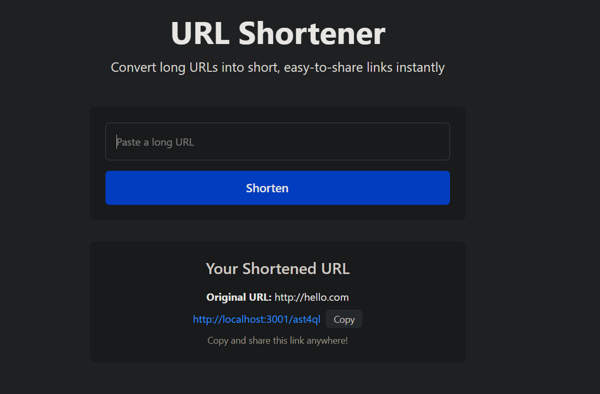

# URL Shortner

`url-shortner` is a fast, secure, and efficient URL shortening service built with Go. It generates unique, random alphanumeric codes for URLs, ensuring unpredictability and uniqueness. The application uses PostgreSQL with GORM ORM, Tailwind for UI, and `templ` for template generation.

---




## Features

- Shorten long URLs to compact codes
- Redirect to original URLs securely
- Unique, random code generation
- Database persistence using PostgreSQL
- Live reload for frontend/backend development

---

## Technology Stack

- **Backend:** Go, GORM ORM
- **Database:** PostgreSQL
- **Frontend:** Tailwind CSS
- **Templates:** templ
- **Containerization:** Docker & Docker Compose
- **Build Tools:** Makefile

---

## Prerequisites

Before running the project, make sure you have:

- [Go](https://golang.org/) installed (v1.20+ recommended)
- [Docker](https://www.docker.com/) & Docker Compose
- Make
- Optional: `psql` CLI for database inspection

---

## Getting Started

1. **Clone the repository**

    ```bash
      git clone <repository-url>
      cd url-shortner
    ```

2. **Create a `.env` file**

    ```bash
      cp .env.example .env
    ```

   Update the file with your local configuration.

3. **Set up PostgreSQL database**

   * Start the Docker container:

        ```bash
          docker compose up -d
        ```

   * Example `.env` configuration:

      ```env
        DB_HOST=localhost
        DB_PORT=5432
        DB_NAME=url-shortner
        DB_USER=testing
        DB_PASSWORD=12345678
     ```

   * Verify connection:

     ```bash
     psql -h localhost -p 5432 -U yusuf -d url-shortner
     ```

     If prompted, enter your password. You should see the `url-shortner` database.

   * If the database does not exist (first-time setup):

     ```sql
     CREATE DATABASE "url-shortner";
     ```

4. **Run the application**

   ```bash
   make watch
   ```

5. **Open in browser**

   ```
   http://localhost:3001
   ```

   to access live reload version.

**NOTE:** Always run the application on port 3000. If you change the port in `.env`, also update `.air.toml`.

---

## Environment Variables

| Variable     | Description                     | Example                                        |
| ------------ | ------------------------------- | ---------------------------------------------- |
| DB\_HOST     | Database host                   | localhost                                      |
| DB\_PORT     | Database port                   | 5431                                           |
| DB\_NAME     | Database name                   | url-shortner                                   |
| DB\_USER     | Database user                   | yusuf                                          |
| DB\_PASSWORD | Database password               | 12345678                                       |
| DB\_SSLMODE  | Enable/disable SSL for Postgres | disable                                        |
| PORT         | Application port                | 3000                                           |
| WEB\_PORT    | Proxy / frontend port           | 3002                                           |
| APP\_URL     | App URL for local testing       | [http://localhost:3001](http://localhost:3001) |
| ENV          | Environment (local/dev/prod)    | local                                          |

---

## Usage

**Build the application**

```bash
make build
```

**Run the application**

```bash
make run
```

**Live reload for development**

```bash
make watch
```

**Clean up binaries from previous build**

```bash
make clean
```

**Generate templ function files**

```bash
templ generate
```

---

## Testing

Run all tests:

```bash
go test ./...
```

---

## Contributing

1. Fork the repository
2. Create a feature branch
3. Run tests
4. Submit a pull request

---

## License

This project is licensed under the MIT License.
